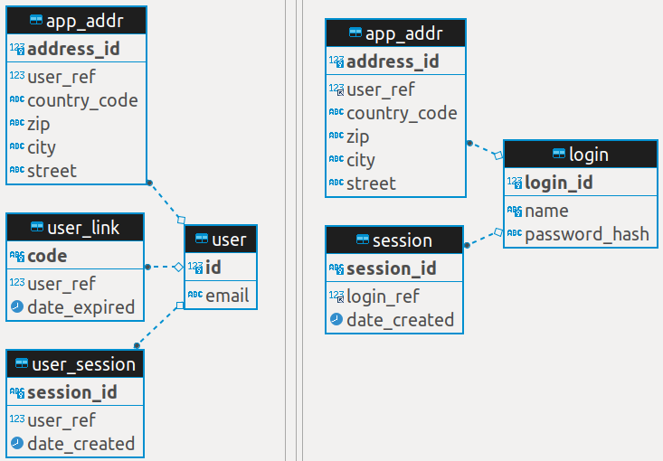

# habr_dem_app

This demo application based on Tequila Framework and creates 2 schemas in 2 RDBMS (MySQL/MariaDB & PostgreSQL) using DEM (Domain Entities Map - declarative schema in JSON format).

Demo is made for Habr article "[Декларативная схема данных: создание единой структуры из фрагментов](https://habr.com/ru/post/577362/)".

## Install

```shell
$ npm install
```


## Config

```shell
$ cd ./cfg
$ cp init.json local.json
$ nano local.json
// set parameters to connect to 'dbLink' & 'dbPwd' DBs
```


## Run

```shell
$ npm run schema
```


## Declarative schemas

This main npm-package uses 2 dependencies (`@flancer64/habr_dem_user_link` & `@flancer64/habr_dem_user_pwd`). There are 3 fragments of schema declaration:
* [app](https://github.com/flancer64/habr_dem_app/blob/0.1.0/etc/teqfw.schema.json)
* [user link](https://github.com/flancer64/habr_dem_user_link/blob/0.1.0/etc/teqfw.schema.json)
* [user pwd](https://github.com/flancer64/habr_dem_user_pwd/blob/0.1.0/etc/teqfw.schema.json)

Also, there are 2 mapping files to merge fragments:
* [app + user link](https://github.com/flancer64/habr_dem_app/blob/0.1.0/etc/teqfw.schema.map.json) => to make schema for `dbLink`
* [app + user pwd](https://github.com/flancer64/habr_dem_app/blob/0.1.0/etc/teqfw.schema.map.pwd.json) => to make schema for `dbPwd`


## Expected result


